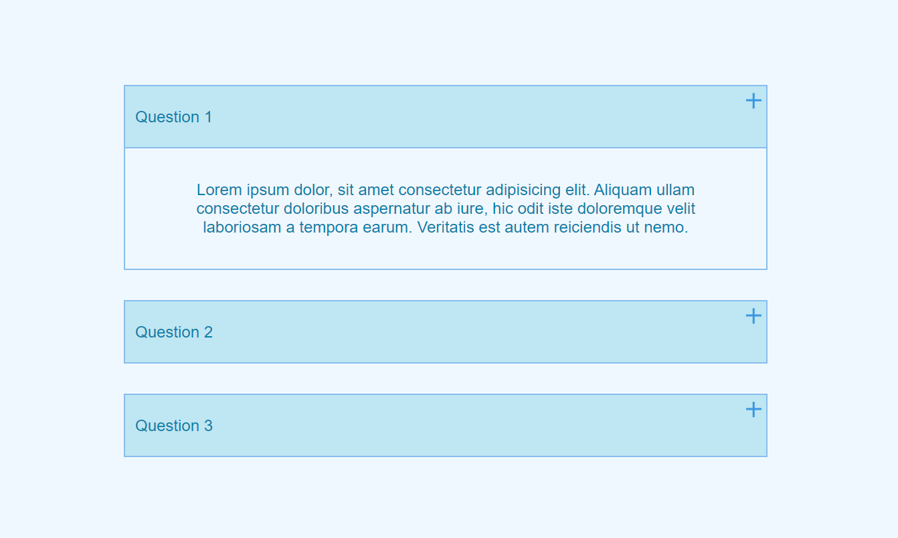

# FAQ-Dropdown

## Overview

FAQ-Dropdown is a simple and interactive FAQ (Frequently Asked Questions) component that allows users to expand and collapse answers by clicking on a plus icon. It provides a user-friendly way to access information and find answers to common questions.

## Features

- Expand and collapse answers with a single click.
- Easily customize the questions and answers to suit your needs.
- Responsive design for seamless viewing on different devices.

